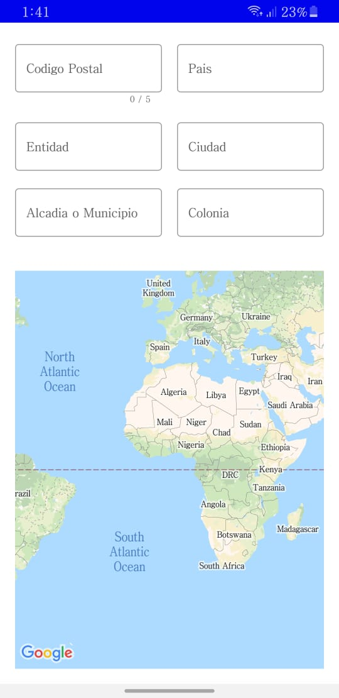
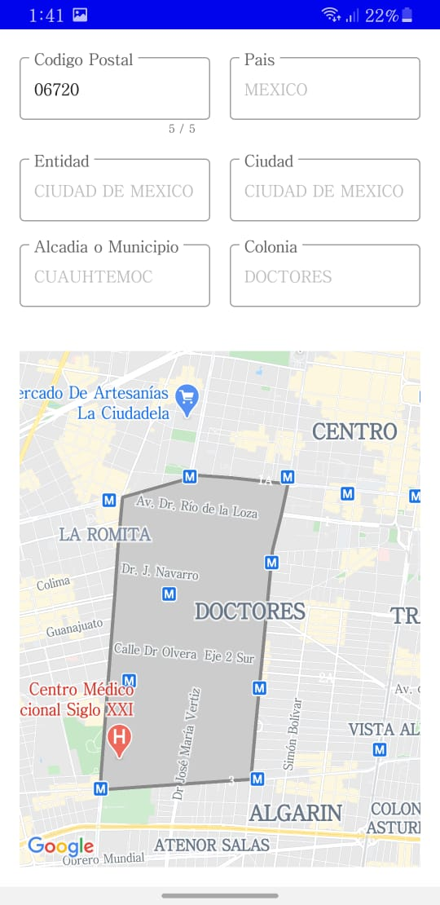

# Challenge-Android
I use the MVVM pattern for this this app, where each component has a function that I describe below.

`DataSource` - Request the information to the API.  
`Repository` - Manage the functions in charge of requesting the information.  
`ViewModel` - This class is designed to store and manage UI-related data in a lifecycle conscious way.  

The home screen:

When you finish typing the CP that has 5 numbers, automatically the request to the API will be made to obtain the information and the polygon.

